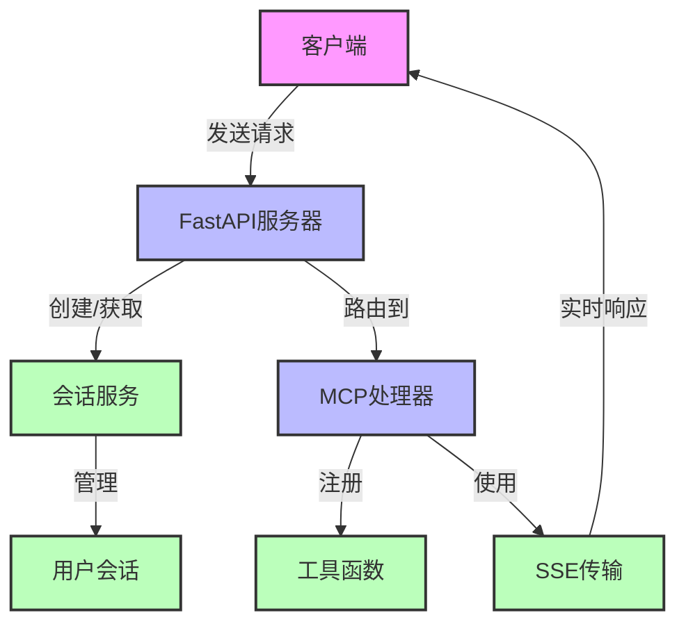
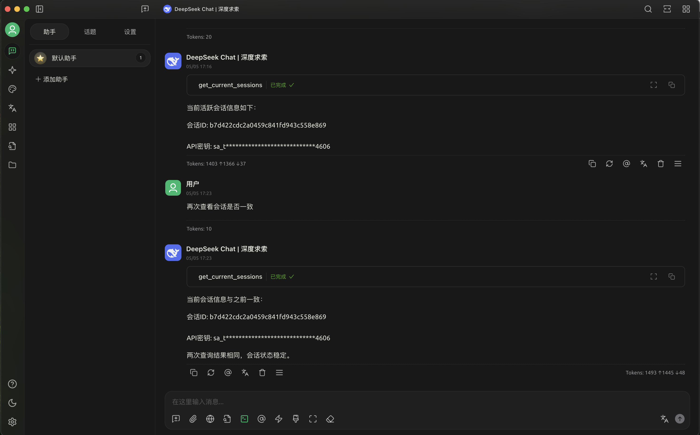
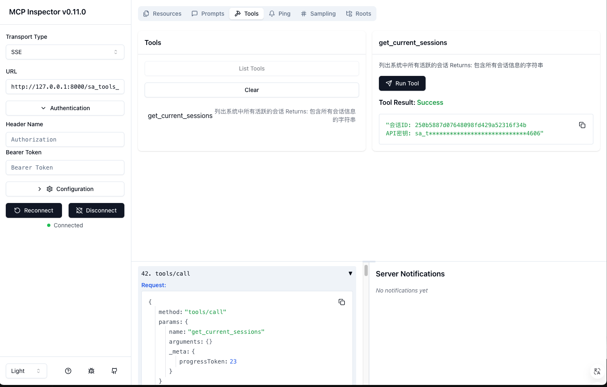
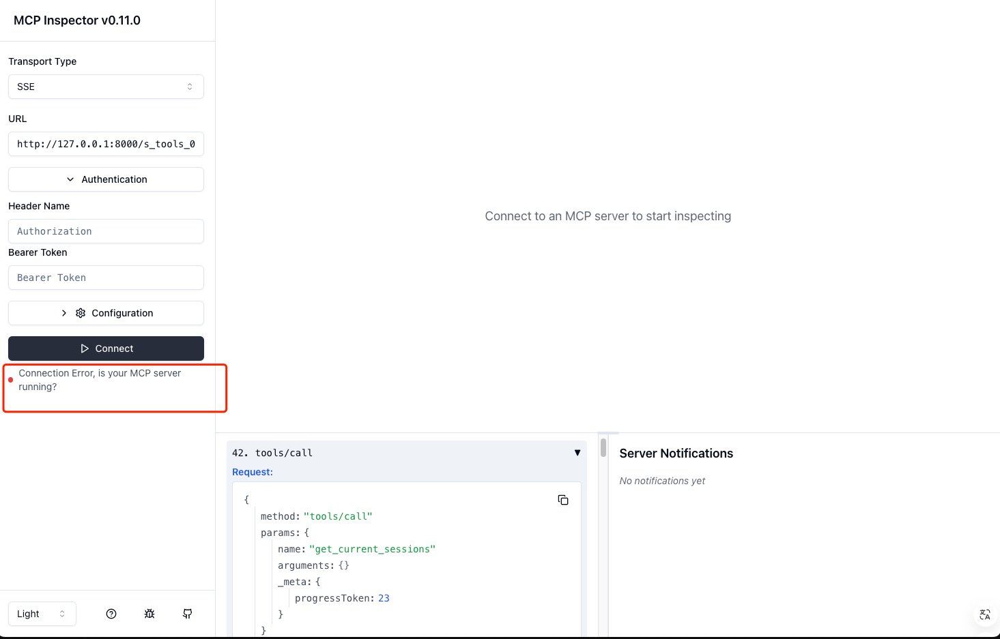

# 🚀 FastAPI MCP 服务器


FastAPI MCP服务器是一个专为大型语言模型设计的Model Context Protocol (MCP) 集成应用，基于FastAPI框架开发，提供高性能的服务器端事件(SSE)通信、智能工具注册和完善的会话管理功能。

## 📖 项目简介

此项目是一个轻量级、高性能的MCP服务器实现，旨在简化AI模型与用户应用程序之间的交互。它利用FastAPI的异步特性和Schema验证能力，结合SSE（Server-Sent Events）技术实现低延迟的实时通信，并通过会话管理系统支持多用户、多模型并发交互，为开发AI驱动的应用提供强大后端支持。

## ✨ 项目亮点

- **🔄 FastAPI + MCP整合**：将FastAPI的高性能与MCP协议无缝集成，提供标准化的模型交互接口
- **📡 高效SSE实时通信**：基于服务器发送事件(SSE)实现毫秒级响应的单向实时数据流
- **👥 多用户会话隔离**：完善的会话创建、存储和管理机制，确保多用户场景下的数据隔离
- **🔐 灵活认证机制**：支持多种认证方式，包括token、path和query参数，满足不同场景需求
- **⚡ 全异步处理架构**：从请求处理到数据库操作均采用异步设计，支持高并发访问
- **🧰 智能工具注册系统**：简化AI工具函数的注册和管理，便于扩展模型能力


## 🔍 工作原理



## 📸 屏幕截图

### MCP交互界面


### MCP Inspector参数无感透传


### MCP Inspector参数鉴权校验


## 📁 项目结构

```
fastapi-mcp-server/
├── auth/               # 认证相关模块
├── database/           # 数据库连接和管理
├── models/             # 数据模型定义
├── routes/             # API路由定义
├── services/           # 业务逻辑服务
├── tools/              # 工具函数
├── transport/          # 传输层实现
├── utils/              # 通用工具函数
├── config.py           # 配置文件
├── main.py             # 应用入口
└── server.py           # MCP服务器初始化
```

## 🛠️ 安装指南

### 前置条件

- 🐍 Python 3.13+
- 🗄️ 支持异步的数据库(可选)
- 📦 uv包管理器(推荐)

### 安装步骤

1. 克隆代码库：

```bash
git clone git@github.com:purity3/fastapi-mcp-server.git
cd fastapi-mcp-server
```

2. 创建并激活虚拟环境：

```bash
python -m venv .venv
source .venv/bin/activate  # Linux/Mac
# 或者
.venv\Scripts\activate     # Windows
```

3. 安装依赖：

使用uv安装(推荐)：
```bash
# 如果尚未安装uv
pip install uv

# 使用uv安装依赖
uv pip install -e .
```

或使用pip安装：
```bash
pip install -e .
```

4. 配置环境变量：

创建`.env`文件，参考`.env.example`设置必要的环境变量。

5. 创建数据库：

需要在database目录下创建session.db数据库文件，可以通过运行以下命令初始化：

```bash
# 确保database目录存在
mkdir -p database

# 创建空的session.db文件
touch database/session.db

# 应用程序首次运行时会自动创建必要的表结构
```

6. 自定义鉴权逻辑：

在`auth/credential.py`中实现您自己的API密钥验证逻辑。默认提供了基本框架，您需要根据自己的需求修改：

```python
# 示例：自定义鉴权逻辑
async def verify_api_key(api_key: str) -> bool:
    """
    验证API密钥是否有效
    
    Args:
        api_key: 要验证的API密钥
    
    Returns:
        如果API密钥有效则返回True，否则返回False
    """
    # 实现您的自定义验证逻辑
    # 可以是本地验证、数据库查询或远程API调用
    
    # 简单示例：检查API密钥格式和前缀
    if not api_key or not api_key.startswith("sk_"):
        return False
        
    # 添加更多验证步骤...
    
    return True  # 验证通过
```

## 🚀 使用指南

### 启动服务器

使用Python启动：
```bash
python -m main
# 或使用安装的入口点
start
```

使用uv启动：
```bash
uv run start
```

使用inspector模式启动（调试）：
```bash
mcp dev server.py
```

服务器默认运行在 http://localhost:8000

### 自定义工具

在`tools/`目录下添加您的自定义工具函数，并在`server.py`中注册：

```python
@mcp.tool()
def your_custom_tool():
    # 实现您的工具逻辑
    pass
```

## ⚙️ 环境变量

| 变量名 | 描述 | 默认值 | 是否必需 |
|-------|------|-------|---------|
| `HOST` | 服务器主机 | 127.0.0.1 | 否 |
| `PORT` | 服务器端口 | 8000 | 否 |
| `DATABASE_URL` | 数据库连接地址 | 无 | 是 |

## 🔧 常见问题解决

### 连接问题

- **无法启动服务器**：检查端口是否被占用，尝试更改`PORT`环境变量
- **SSE连接断开**：检查网络连接，或者客户端超时设置

### 工具注册问题

- **工具注册失败**：确保工具函数格式正确，并且已正确导入
- **工具执行错误**：检查工具函数的错误处理逻辑

### 会话管理问题

- **会话创建失败**：检查数据库连接配置
- **会话过期**：调整会话过期时间，或确保客户端保持活跃连接

## 🔮 未来规划

我们计划在未来版本中添加以下功能：

- [ ] **Docker容器部署**
  - [ ] 创建优化的Docker镜像
  - [ ] 提供docker-compose配置
  - [ ] 支持多容器协作部署

- [ ] **IP黑白名单系统**
  - [ ] 基于IP的访问控制
  - [ ] 支持CIDR格式的网络规则
  - [ ] 可配置的拦截策略

- [ ] **FastMCP Streamable模式支持**
  - [ ] 支持异步流式响应传输
  - [ ] 实现MCP协议的流式处理机制
  - [ ] 提供流式传输的进度监控和错误处理

- [ ] **高级监控与日志**
  - [ ] 实时性能监控
  - [ ] 结构化日志输出
  - [ ] 分布式追踪支持

## 📜 许可证

本项目采用 MIT 许可证 - 详情请查看 [LICENSE](LICENSE) 文件。
